```R
setwd('C:/Users/bki19/desktop/Bayesian_NBA')
```

# 베이지안 기법을 이용한 NBA 우승 팀 예측

NBA 리그팀 중에 어떤 팀이 2019 플레이오프에서 우승할까? <br>
- 시즌 동안 강했던 상대한테 플레이오프에서도 강하지 않을까?<br>
- 베이지안과 Frequentist 방법을 비교<br>

<b>목차</b>
1. 모델링
2. 데이터 소개
3. 전처리
4. MLE
5. Independence Sampler
6. Conjugacy
7. Monte-carlo Simulation

# 1. 모델링

- 매년 선수 영입에 따라 팀의 실력 변화가 크기 때문에 리그 경기 결과만 이용<br>
- NBA는 리그 동안 팀당 약 82경기를 치르게 됨
- 팀 간에 비기는 경우는 없음
- 팀 간의 상대 전적을 이용해서 모델링

<b>Bernoulli 분포 가정과 사후 분포</b>

팀 $i$가 팀 $j$를 이기는 경우는 이기고 지고 두 결과 밖에 없기 때문에 Bernoulli 분포를 따른다고 가정<br>
사후 분포로는 Conjugacy를 이용하기 위해 Beta 분포 가정

데이터의 분포: $X_{i,j} \sim iid  Bernoulli(p_{i,j})$ ;   팀 i가 팀 j이기면 $X_{i,j}=1$  <br>
사전 분포: $p_{i,j} \sim Beta(\alpha, \beta)$<br>
사후 분포: $p_{i,j}|X_{i,j} \sim Beta(x_{i,j}+\alpha,1-x_{i,j}+\beta)$

- $p_{i,j}$: 팀 i가 팀 j를 이길 확률<br>
- $p_{j,i}=1-p_{i,j}$ : 비길 확률 없음<br>
- $X_{ij}$는 팀 i가 팀 j를 이길 확률에 대한 확률 변수로 비기는 경우가 없이 이기고 지는 경우만 고려해 Beroulli 분포를 따른다고 가정<br>
- 모수 $p_{ij}$는 conjugate prior인 Beta 분포를 가정,이를 통해 사후 분포도 Beta로 쉽게 구할 수 있음

<b>Binomial 분포 가정과 사후 분포</b>

- 팀마다 상대팀을 만나는 횟수는 다름
- 팀$i$가 팀 $j$을 이길 확률은 이전 결과가 영향을 주지 않는다고 단순화 (Independency)
- 따라서 팀 i가 팀 j를 이긴 횟수에 대한 분포 $Y_{ij}$는 iid 가정에 의해 Binomial 분포를 따르게 됨

$Y_{i,j} \sim iid Binomial(n_{i,j},p_{i,j})$<br>
$p_{i,j} \sim Beta (\alpha,\beta)$<br>
$p_{i,j}|Y_{i,j} \sim Beta (y_{i,j}+\alpha,n_{i,j}-y_{i,j}+\beta $<br>

MLE<br>
$\hat{p}_{i,j}=\frac{y_{i,j}}{n_{i,j}}$

Bayesian Poseterior Mean<br>
$E[p_{i,j}|Y_{i,j}]=\frac{y_{i,j}+\alpha}{n_{i,j}+\alpha+\beta} $

- MLE:Binomial 분포를 가정했기 때문에 MLE는 해당 팀의 총 경기 수 중에 이긴 경기의 수의 비율로 쉽게 구할 수 있음<br>
- Posterior Mean: 확률 변수이기 때문에 확률적 기댓값을 갖게 됨


# 2. 데이터 소개


```R
#Division Folder
Leagues<-list.files('./data')
Leagues
length(Leagues)
```


<ol class=list-inline>
	<li>'Atlantic Division'</li>
	<li>'Central Division'</li>
	<li>'Northwest Division'</li>
	<li>'Pacific Division'</li>
	<li>'Southeast Division'</li>
	<li>'Southwest Division'</li>
</ol>


6


데이터는 6개의 디비전으로 구성되어 있음


```R
#Team Name List
TEAMS=c()
for (i in 1:6){
    a<-paste0('./data/',Leagues[i])
    TEAMS=c(TEAMS, list.files(a)  )
}
TEAMS2<-gsub('.{4}$', '', TEAMS)
TEAMS2
```


<ol class=list-inline>
	<li>'Boston Celtics'</li>
	<li>'Philadelphia 76ers'</li>
	<li>'Toronto Raptors'</li>
	<li>'Detroit Pistons'</li>
	<li>'Indiana Pacers'</li>
	<li>'Milwaukee Bucks'</li>
	<li>'Denver Nuggets'</li>
	<li>'Oklahoma City'</li>
	<li>'Portland Trail Blazers'</li>
	<li>'Utah Jazz'</li>
	<li>'Golden State Warriors'</li>
	<li>'Los Angeles Clippers'</li>
	<li>'Orlando Magic'</li>
	<li>'Houston Rockets'</li>
	<li>'San Antonio Spurs'</li>
</ol>


폴더: 속한 리그<br>
파일: 해당 리그에서 파이널에 진출한 팀 => 폴더마다 다른 숫자의 csv 파일이 들어 있음<br>
<br>
파일마다 해당 팀이 리그 내에서 어떤 팀에게 이기고 졌는지에 대한 기록이 있음=> 파이널에 진출 안한 팀에 대한 기록까지 있음<br>


```R
#Number of Playoff teams in data
NUM_TEAMS=c()
for (i in 1:6){
    b<-paste0('./data/',Leagues[i])
    NUM_TEAMS=c(NUM_TEAMS, length(list.files(b) )  )
}
```


```R
data.frame(League=Leagues, Teams= NUM_TEAMS)
length(TEAMS2)
TEAMS2
```


<table>
<thead><tr><th scope=col>League</th><th scope=col>Teams</th></tr></thead>
<tbody>
	<tr><td>Atlantic Division </td><td>3                 </td></tr>
	<tr><td>Central Division  </td><td>3                 </td></tr>
	<tr><td>Northwest Division</td><td>4                 </td></tr>
	<tr><td>Pacific Division  </td><td>2                 </td></tr>
	<tr><td>Southeast Division</td><td>1                 </td></tr>
	<tr><td>Southwest Division</td><td>2                 </td></tr>
</tbody>
</table>


15


<ol class=list-inline>
	<li>'Boston Celtics'</li>
	<li>'Philadelphia 76ers'</li>
	<li>'Toronto Raptors'</li>
	<li>'Detroit Pistons'</li>
	<li>'Indiana Pacers'</li>
	<li>'Milwaukee Bucks'</li>
	<li>'Denver Nuggets'</li>
	<li>'Oklahoma City'</li>
	<li>'Portland Trail Blazers'</li>
	<li>'Utah Jazz'</li>
	<li>'Golden State Warriors'</li>
	<li>'Los Angeles Clippers'</li>
	<li>'Orlando Magic'</li>
	<li>'Houston Rockets'</li>
	<li>'San Antonio Spurs'</li>
</ol>


- 총 15개의 팀의 경기 기록 (Brooklyn Nets 누락)<br>
- 플레이오프 진출하지 않은 팀과의 경기 기록도 있음 => 플레이오프 팀 간 상대 전적만 고려하기 때문에 제거<br>
- Oklahoma City가 다른 팀과 경기한 기록은 있지만 다른 팀이 Oklahoma City와 경기한 기록은 누락 됨<br>
- Oklahoma City 경기 기록을 바탕으로 다른 팀과 Oklahoma City가 경기한 기록 복원<br>
- Brooklyn Nets와 경기한 데이터를 바탕으로 Brooklyn Nets 데이터 복원


```R
#Add Brooklyn Nets
TEAMS2<-c(TEAMS2,'Brooklyn Nets')
```

# 3. 데이터 전처리


```R
#Load Multiple Data from Multiple Folders

Read_Function<-function(H){
    #Make path for loading multiple files
    Leagues<-list.files('./data')
    TEAMS=c()
    PATH<-c()
    for (i in 1:6){
        a<-paste0('./data/',Leagues[i])
        b<-list.files(a) #list of files in the folder
        for (j in 1:length(b)){
            c<-paste0 (paste0(a,'/'),b[j])
            PATH<-c(PATH,c)
        }

    }
    
    #Make derived variable win Frequency, Total Frequency, Mean
    df<-read.csv(PATH[H])
    df$WIN<-ifelse(df[,'X']=='W',1,0)
    df$COUNT<-ifelse(df[,'X']=='W',1,1)

    df2<-df[,c('Opponent','COUNT')]
    df2<-aggregate(COUNT~.,FUN=sum,data=df2)
    
    df<-df[,c('Opponent','WIN')]
    df<-aggregate(WIN~.,FUN=sum,data=df)
    
    df$Freq<-df2$COUNT
    df$MEAN<-df$WIN/df$Freq
    
    #remain variable of interest

    df3<-data.frame(Opponent=c(),WIN=c(),Freq=c(),MEAN=c())
    NOT<-c()
    for (i in 1:16){
        if ( TEAMS2[i]  %in%  unique(df[,'Opponent']) ){
            df3=rbind(df3, df[df[,'Opponent']== TEAMS2[i],]  )

        }
        else{
            NOT<-data.frame(Opponent=TEAMS2[i],WIN=NA,Freq=NA,MEAN=NA)
            names(NOT)<-names(df)
            df3<-rbind(df3,NOT)
            }
        }
    return (df3)
    
}
```


```R
## fill missing data and drop useless data
B<-Read_Function(8)# oklahoma
df<-list()
for (i in 1:15){
    df[[i]]<-Read_Function(i)
    df[[i]][8,c('WIN','Freq','MEAN')]<-c((B[i,]$Freq-B[i,]$WIN),B[i,]$Freq,((B[i,]$Freq-B[i,]$WIN)/B[i,]$Freq))
    df[[i]]<-na.omit(df[[i]])
}
```

Oklahoma City와의 경기 기록 복원<br>
Oklahoma City와 경기한 상대팀의 기록은 모두 결측 되어 있음<br>
다행히도 Oklahoma City의 csv 파일 안에는 상대팀에 대한 기록들이 기록되어 있어 이것을 토대로 결측치 처리


```R
D<-data.frame(Opponent= NA,WIN= NA,Freq=NA,MEAN= NA)
for (i in 1:15){
    C<-data.frame(Opponent= TEAMS2[i],WIN= (df[[i]][15,'Freq']-df[[i]][15,'WIN']),Freq=df[[i]][15,'Freq'],MEAN= (df[[i]][15,'Freq']-df[[i]][15,'WIN'])/  df[[i]][15,'Freq'])
    D<-rbind(D,C)
}
df[[16]]<-D[-1,]
```


```R
#Brooklyn Nets
df[[16]]
```


<table>
<thead><tr><th></th><th scope=col>Opponent</th><th scope=col>WIN</th><th scope=col>Freq</th><th scope=col>MEAN</th></tr></thead>
<tbody>
	<tr><th scope=row>2</th><td>Boston Celtics        </td><td>2                     </td><td>4                     </td><td>0.5000000             </td></tr>
	<tr><th scope=row>3</th><td>Philadelphia 76ers    </td><td>2                     </td><td>4                     </td><td>0.5000000             </td></tr>
	<tr><th scope=row>4</th><td>Toronto Raptors       </td><td>1                     </td><td>4                     </td><td>0.2500000             </td></tr>
	<tr><th scope=row>5</th><td>Detroit Pistons       </td><td>2                     </td><td>3                     </td><td>0.6666667             </td></tr>
	<tr><th scope=row>6</th><td>Indiana Pacers        </td><td>1                     </td><td>3                     </td><td>0.3333333             </td></tr>
	<tr><th scope=row>7</th><td>Milwaukee Bucks       </td><td>1                     </td><td>4                     </td><td>0.2500000             </td></tr>
	<tr><th scope=row>8</th><td>Denver Nuggets        </td><td>2                     </td><td>2                     </td><td>1.0000000             </td></tr>
	<tr><th scope=row>9</th><td>Oklahoma City         </td><td>0                     </td><td>2                     </td><td>0.0000000             </td></tr>
	<tr><th scope=row>10</th><td>Portland Trail Blazers</td><td>0                     </td><td>2                     </td><td>0.0000000             </td></tr>
	<tr><th scope=row>11</th><td>Utah Jazz             </td><td>0                     </td><td>2                     </td><td>0.0000000             </td></tr>
	<tr><th scope=row>12</th><td>Golden State Warriors </td><td>0                     </td><td>2                     </td><td>0.0000000             </td></tr>
	<tr><th scope=row>13</th><td>Los Angeles Clippers  </td><td>0                     </td><td>2                     </td><td>0.0000000             </td></tr>
	<tr><th scope=row>14</th><td>Orlando Magic         </td><td>2                     </td><td>3                     </td><td>0.6666667             </td></tr>
	<tr><th scope=row>15</th><td>Houston Rockets       </td><td>1                     </td><td>2                     </td><td>0.5000000             </td></tr>
	<tr><th scope=row>16</th><td>San Antonio Spurs     </td><td>1                     </td><td>2                     </td><td>0.5000000             </td></tr>
</tbody>
</table>


Brooklyn Nets 복구


```R
Count_matrix=matrix(0,16,16)
colnames(Count_matrix)=TEAMS2
rownames(Count_matrix)=TEAMS2

Mean_matrix=matrix(0,16,16)
colnames(Mean_matrix)=TEAMS2
rownames(Mean_matrix)=TEAMS2

Win_matrix=matrix(0,16,16)
colnames(Win_matrix)=TEAMS2
rownames(Win_matrix)=TEAMS2
```

Count_matrix: 팀 간 경기 횟수을 기록한 행렬<br>
Mean_matrix: 팀 간 승률을 기록한 행렬<br>
Win_matrix: 팀 간 승리 횟수를 기록한 행렬


```R
for (i in 1:16){
    c<-df[[i]][,'WIN']
    c<-append(c,NA,(i-1))
    Win_matrix[i,]<-c
    
    d<-df[[i]][,'MEAN']
    d<-append(d,NA,(i-1))
    Mean_matrix[i,]<-d
    
    e<-df[[i]][,'Freq']
    e<-append(e,NA,(i-1))
    Count_matrix[i,]<-e
}
```


```R
Mean_matrix
```


<table>
<thead><tr><th></th><th scope=col>Boston Celtics</th><th scope=col>Philadelphia 76ers</th><th scope=col>Toronto Raptors</th><th scope=col>Detroit Pistons</th><th scope=col>Indiana Pacers</th><th scope=col>Milwaukee Bucks</th><th scope=col>Denver Nuggets</th><th scope=col>Oklahoma City</th><th scope=col>Portland Trail Blazers</th><th scope=col>Utah Jazz</th><th scope=col>Golden State Warriors</th><th scope=col>Los Angeles Clippers</th><th scope=col>Orlando Magic</th><th scope=col>Houston Rockets</th><th scope=col>San Antonio Spurs</th><th scope=col>Brooklyn Nets</th></tr></thead>
<tbody>
	<tr><th scope=row>Boston Celtics</th><td>       NA</td><td>0.7500000</td><td>0.5000000</td><td>0.7500000</td><td>0.7500000</td><td>0.3333333</td><td>0.00     </td><td>1.0000000</td><td>0.0000000</td><td>0.0000000</td><td>0.5000000</td><td>0.0000000</td><td>0.0000000</td><td>0.0000000</td><td>0.0000000</td><td>0.5000000</td></tr>
	<tr><th scope=row>Philadelphia 76ers</th><td>0.2500000</td><td>       NA</td><td>0.2500000</td><td>0.7500000</td><td>0.7500000</td><td>0.3333333</td><td>0.50     </td><td>0.5000000</td><td>0.0000000</td><td>1.0000000</td><td>0.5000000</td><td>1.0000000</td><td>0.5000000</td><td>0.5000000</td><td>0.5000000</td><td>0.5000000</td></tr>
	<tr><th scope=row>Toronto Raptors</th><td>0.5000000</td><td>0.7500000</td><td>       NA</td><td>0.0000000</td><td>0.6666667</td><td>0.2500000</td><td>0.00     </td><td>0.5000000</td><td>0.5000000</td><td>1.0000000</td><td>1.0000000</td><td>1.0000000</td><td>0.5000000</td><td>0.0000000</td><td>0.5000000</td><td>0.7500000</td></tr>
	<tr><th scope=row>Detroit Pistons</th><td>0.2500000</td><td>0.2500000</td><td>1.0000000</td><td>       NA</td><td>0.2500000</td><td>0.0000000</td><td>0.50     </td><td>0.0000000</td><td>0.5000000</td><td>0.0000000</td><td>0.5000000</td><td>0.5000000</td><td>0.7500000</td><td>0.5000000</td><td>0.0000000</td><td>0.3333333</td></tr>
	<tr><th scope=row>Indiana Pacers</th><td>0.2500000</td><td>0.2500000</td><td>0.3333333</td><td>0.7500000</td><td>       NA</td><td>0.2500000</td><td>0.50     </td><td>0.5000000</td><td>0.0000000</td><td>1.0000000</td><td>0.0000000</td><td>0.5000000</td><td>0.2500000</td><td>0.0000000</td><td>0.5000000</td><td>0.6666667</td></tr>
	<tr><th scope=row>Milwaukee Bucks</th><td>0.6666667</td><td>0.6666667</td><td>0.7500000</td><td>1.0000000</td><td>0.7500000</td><td>       NA</td><td>1.00     </td><td>0.0000000</td><td>0.5000000</td><td>0.5000000</td><td>0.5000000</td><td>0.5000000</td><td>0.6666667</td><td>1.0000000</td><td>0.5000000</td><td>0.7500000</td></tr>
	<tr><th scope=row>Denver Nuggets</th><td>1.0000000</td><td>0.5000000</td><td>1.0000000</td><td>0.5000000</td><td>0.5000000</td><td>0.0000000</td><td>  NA     </td><td>1.0000000</td><td>0.7500000</td><td>0.2500000</td><td>0.2500000</td><td>0.7500000</td><td>1.0000000</td><td>0.2500000</td><td>0.5000000</td><td>0.0000000</td></tr>
	<tr><th scope=row>Oklahoma City</th><td>0.0000000</td><td>0.5000000</td><td>0.5000000</td><td>1.0000000</td><td>0.5000000</td><td>1.0000000</td><td>0.00     </td><td>       NA</td><td>1.0000000</td><td>1.0000000</td><td>0.3333333</td><td>0.5000000</td><td>1.0000000</td><td>0.7500000</td><td>0.3333333</td><td>1.0000000</td></tr>
	<tr><th scope=row>Portland Trail Blazers</th><td>1.0000000</td><td>1.0000000</td><td>0.5000000</td><td>0.5000000</td><td>1.0000000</td><td>0.5000000</td><td>0.25     </td><td>0.0000000</td><td>       NA</td><td>0.5000000</td><td>0.5000000</td><td>0.7500000</td><td>1.0000000</td><td>0.6666667</td><td>0.5000000</td><td>1.0000000</td></tr>
	<tr><th scope=row>Utah Jazz</th><td>1.0000000</td><td>0.0000000</td><td>0.0000000</td><td>1.0000000</td><td>0.0000000</td><td>0.5000000</td><td>0.75     </td><td>0.0000000</td><td>0.5000000</td><td>       NA</td><td>0.3333333</td><td>0.6666667</td><td>0.5000000</td><td>0.5000000</td><td>0.6666667</td><td>1.0000000</td></tr>
	<tr><th scope=row>Golden State Warriors</th><td>0.5000000</td><td>0.5000000</td><td>0.0000000</td><td>0.5000000</td><td>1.0000000</td><td>0.5000000</td><td>0.75     </td><td>0.6666667</td><td>0.5000000</td><td>0.6666667</td><td>       NA</td><td>0.7500000</td><td>0.5000000</td><td>0.2500000</td><td>0.3333333</td><td>1.0000000</td></tr>
	<tr><th scope=row>Los Angeles Clippers</th><td>1.0000000</td><td>0.0000000</td><td>0.0000000</td><td>0.5000000</td><td>0.5000000</td><td>0.5000000</td><td>0.25     </td><td>0.5000000</td><td>0.2500000</td><td>0.3333333</td><td>0.2500000</td><td>       NA</td><td>1.0000000</td><td>0.6666667</td><td>0.5000000</td><td>1.0000000</td></tr>
	<tr><th scope=row>Orlando Magic</th><td>1.0000000</td><td>0.5000000</td><td>0.5000000</td><td>0.2500000</td><td>0.7500000</td><td>0.3333333</td><td>0.00     </td><td>0.0000000</td><td>0.0000000</td><td>0.5000000</td><td>0.5000000</td><td>0.0000000</td><td>       NA</td><td>0.5000000</td><td>0.5000000</td><td>0.3333333</td></tr>
	<tr><th scope=row>Houston Rockets</th><td>1.0000000</td><td>0.5000000</td><td>1.0000000</td><td>0.5000000</td><td>1.0000000</td><td>0.0000000</td><td>0.75     </td><td>0.2500000</td><td>0.3333333</td><td>0.5000000</td><td>0.7500000</td><td>0.3333333</td><td>0.5000000</td><td>       NA</td><td>0.7500000</td><td>0.5000000</td></tr>
	<tr><th scope=row>San Antonio Spurs</th><td>1.0000000</td><td>0.5000000</td><td>0.5000000</td><td>1.0000000</td><td>0.5000000</td><td>0.5000000</td><td>0.50     </td><td>0.6666667</td><td>0.5000000</td><td>0.3333333</td><td>0.6666667</td><td>0.5000000</td><td>0.5000000</td><td>0.2500000</td><td>       NA</td><td>0.5000000</td></tr>
	<tr><th scope=row>Brooklyn Nets</th><td>0.5000000</td><td>0.5000000</td><td>0.2500000</td><td>0.6666667</td><td>0.3333333</td><td>0.2500000</td><td>1.00     </td><td>0.0000000</td><td>0.0000000</td><td>0.0000000</td><td>0.0000000</td><td>0.0000000</td><td>0.6666667</td><td>0.5000000</td><td>0.5000000</td><td>       NA</td></tr>
</tbody>
</table>


# 4. MLE

팀 간 이길 확률은 MLE로 봤을 때 단순히 상대 팀에 대한 시즌 내 승률임 


```R
##save barplot

par(mfrow=c(4,4))
for (i in 1:16){
#    plot_name<-paste0('./analysis/plot',i)
#    plot_name<-paste0(plot_name,'.jpg')    
#    jpeg(plot_name)
    barplot(Mean_matrix[i,-i],main=TEAMS2[i] ,las=2,col=i)

#    dev.off() 
}
```


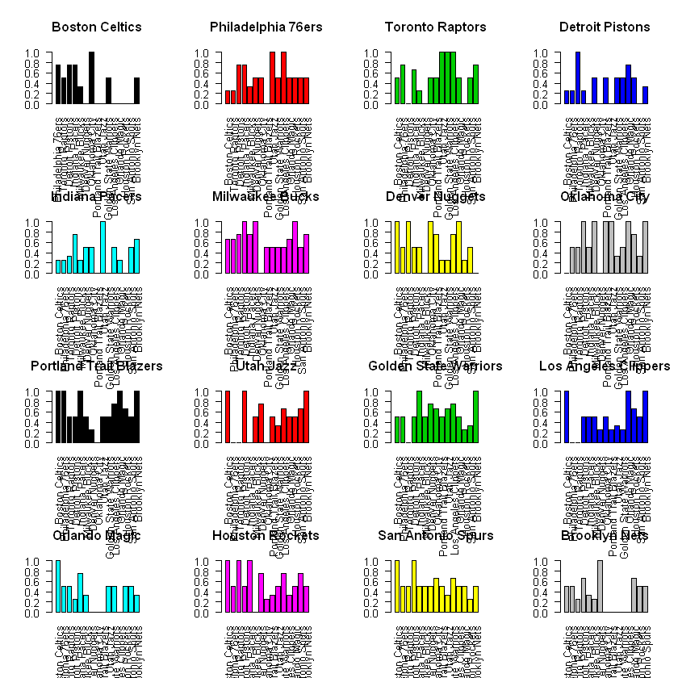


시즌 내 플레이오프 진출 팀에 대한 승률<br>
<br>
- Boston, Detroit, Orlando Brooklyn 등은 여러 팀에게 시즌 동안 한번도 못 이김
- Philadelphia, Portland, Golden State는 Toronto, Denver는 Milwaukee를 제외하고 한 번씩은 이겼음
- San Antonio는 모든 상대에게 승리를 한 경험이 있음
- Milwaukee는 Oklahoma City를 제외하고 모든 상대에게 승률이 50퍼센트 이상


```R
#Data Frame

Total2<-c()
for (i in 1:16){
    Total<-c(TEAMS2[i],sum(df[[i]][,2]),mean(df[[i]][,2]))
    Total2<-rbind(Total2,Total)    
}
Total3<-Total2[order(Total2[,2], decreasing=TRUE),]
colnames(Total3)<-c('Team','Wins','Mean')
Total3
```


<table>
<thead><tr><th></th><th scope=col>Team</th><th scope=col>Wins</th><th scope=col>Mean</th></tr></thead>
<tbody>
	<tr><th scope=row>Total</th><td>Milwaukee Bucks       </td><td>28                    </td><td>1.86666666666667      </td></tr>
	<tr><th scope=row>Total</th><td>Oklahoma City         </td><td>26                    </td><td>1.73333333333333      </td></tr>
	<tr><th scope=row>Total</th><td>Portland Trail Blazers</td><td>25                    </td><td>1.66666666666667      </td></tr>
	<tr><th scope=row>Total</th><td>Denver Nuggets        </td><td>24                    </td><td>1.6                   </td></tr>
	<tr><th scope=row>Total</th><td>Houston Rockets       </td><td>24                    </td><td>1.6                   </td></tr>
	<tr><th scope=row>Total</th><td>Golden State Warriors </td><td>23                    </td><td>1.53333333333333      </td></tr>
	<tr><th scope=row>Total</th><td>Philadelphia 76ers    </td><td>22                    </td><td>1.46666666666667      </td></tr>
	<tr><th scope=row>Total</th><td>Toronto Raptors       </td><td>22                    </td><td>1.46666666666667      </td></tr>
	<tr><th scope=row>Total</th><td>San Antonio Spurs     </td><td>22                    </td><td>1.46666666666667      </td></tr>
	<tr><th scope=row>Total</th><td>Utah Jazz             </td><td>20                    </td><td>1.33333333333333      </td></tr>
	<tr><th scope=row>Total</th><td>Los Angeles Clippers  </td><td>19                    </td><td>1.26666666666667      </td></tr>
	<tr><th scope=row>Total</th><td>Boston Celtics        </td><td>17                    </td><td>1.13333333333333      </td></tr>
	<tr><th scope=row>Total</th><td>Orlando Magic         </td><td>17                    </td><td>1.13333333333333      </td></tr>
	<tr><th scope=row>Total</th><td>Indiana Pacers        </td><td>16                    </td><td>1.06666666666667      </td></tr>
	<tr><th scope=row>Total</th><td>Detroit Pistons       </td><td>15                    </td><td>1                     </td></tr>
	<tr><th scope=row>Total</th><td>Brooklyn Nets         </td><td>15                    </td><td>1                     </td></tr>
</tbody>
</table>


요약 테이블 <br>
- Milwaukee와 Oklahoma, Denver, Houston 등이 이긴 횟수가 가장 많음
- 하지만 특정 팀을 대상로만 강했을 수도 있고, 시즌 동안 강했던 상대를 플레이오프 동안 못 만날 수도 있음
- 따라서 이긴 횟수만으로 예측하기는 어려움

# 5. Independence Sampling

MCMC는 언제 사용할까?<br>
- Expected Posterior Mean이 intractable 한 경우
- Numerical methods로 계산하기 어려울 때 <br>

<b>Monte-Carlo Integration</b><br>
- $f_{\theta|x}$의 random sample $x_{1},...,x_{m}$이 independent 하면 목표 함수 $g(\theta)$의 기댓 값을 추정할 수 있음<br>
- 추정량이 $\bar{g}=\frac{1}{m}\sum g(x_{i})$라고 할 때 데이터가 많아지면 $\bar{g} -> E[g(\theta)]$로 수렴
- Monte-Carlo Integration은 시뮬레이션을 통해 이러한 수렴하는 성질을 이용<br>
- 직접 계산이 어려울 때 시뮬레이션을 통해 계산이 가능<br>

<b>Markov-Chain</b><br>
- 타겟 분포(사후 분포)로부터 random observation을 생성하여 sampler 역할을 함
- 타겟 분포가 복잡하여 할때 MCMC를 통해 타겟 분포에서 Sampling 할 수 있음

<b>Metropolis-Hastings</b><br>
- stationary distribution이 target distribution인 Markov chain을 생성함<br>
- $X_{t}$가 주어졌을 때 다음 $X_{t+1}$를 어떻게 생성할까?
- proposal distirbution $g(·|X_{t})$에서 생성된 후보군 $Y$가 accept 되면 $X_{t+1}$로 인정

1. proposal distribution 선택 $g(·|X_{t})$ 
2. g에서 X0 생성.
3. 반복 (chain이 stationary distribution에 수렴할 때까지):<br>
(a) $g(·|X_{t})$로부터 Y를 생성<br>
(b) Uniform(0,1)에서 U를 생성<br>
(c) If $U ≤ \frac{f(Y )g(X_{t}|Y )}{f(X_{t})g(Y |X_{t})}$<br>
<br>
accept $Y$ and set $X_{t+1} = Y$ ; otherwise set $X_{t+1} = X_{t}$<br>
(d) Increment t.<br>
<br>
참고로 step (3c)에서 후보 Y는 확률 $α(X_{t}, Y) =min(1,\frac{f(Y )g(X_{t}|Y )}{f(X_{t})g(Y |X_{t})})$로 accept


<b>Independence Sampler</b><br>
- proposal distribution은 이전 chain의 값에 영향 받지 않음 => $g(Y|X_{t})$<br>
- $α(X_{t}, Y) =min(1,\frac{f(Y )g(X_{t})}{f(X_{t})g(Y)})$


특징<br>
- 구현하기 쉬움
- proposal이 target density와 가깝게 설정되면 잘 작동함 but 그렇지 않으면 잘 작동 안함 => “it is rare for the independence sampler to be useful as a stand-alone algorithm.”


```R
m <- 10000 #length of chain
independence.sampler<-function(win,n,a,b){


    xt <- numeric(m)

    # generate the independence sampler chain
    u <- runif(m)
    y <- rbeta(m, a, b) #proposal distribution
    for (i in 2:m) {
        fy <- (y[i]^win)*(1-y[i])^(n-win)
        fx <- (xt[i-1]^3)*(1-xt[i-1])

        r <- (fy / fx) *(xt[i-1]^(a-1) * (1-xt[i-1])^(b-1)) /(y[i]^(a-1) * (1-y[i])^(b-1))

        if (u[i] <= r) {xt[i] <- y[i]}
        else {
        xt[i] <- xt[i-1]}
    }
    return(xt)
}
```


```R
sim_exp<-independence.sampler(Win_matrix[1,2],Count_matrix[1,2],1,1)
```


```R
#convergence check
plot(sim_exp, type="l", ylab="p")
hist(sim_exp[((m/2) +1):m], main="", xlab="p", prob=TRUE)
print(mean(sim_exp[((m/2) +1):m]))
```


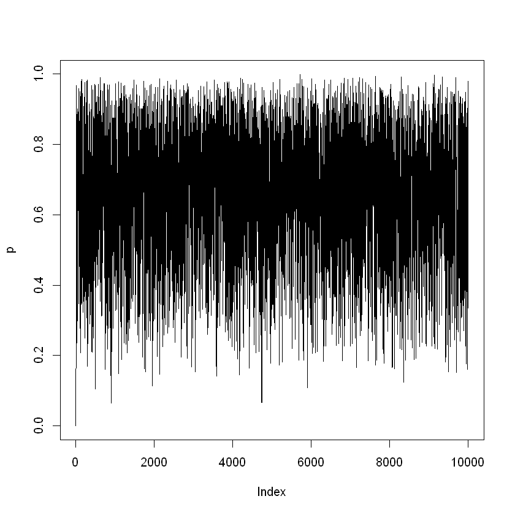


    [1] 0.6653813
    


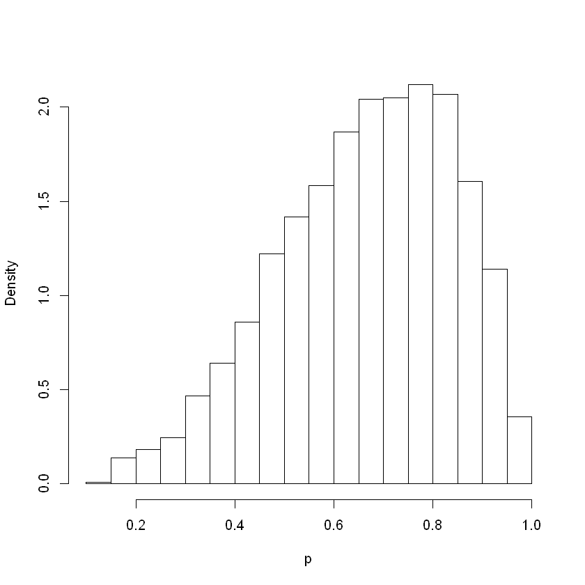


Independence Sampler를 이용해 사후 확률을 추정<br>
Trace plot: Markov-chain의 수렴성을 파악


```R
Sim_matrix=matrix(0,16,16)
colnames(Sim_matrix)=TEAMS2
rownames(Sim_matrix)=TEAMS2
```


```R
set.seed(0)
for (i in 1:16){
    for (j in 1:16){
                if ( is.na(Count_matrix[i,j])==TRUE){
                    Sim_matrix[i,j]<-NA
                }
                else{
                    BB<-independence.sampler(Win_matrix[i,j],Count_matrix[i,j],1,1)
                    Sim_matrix[i,j]<-mean(BB[((m/2) +1):m])
                   }
    }
}
```


```R
#posterior mean
Sim_matrix
```


<table>
<thead><tr><th></th><th scope=col>Boston Celtics</th><th scope=col>Philadelphia 76ers</th><th scope=col>Toronto Raptors</th><th scope=col>Detroit Pistons</th><th scope=col>Indiana Pacers</th><th scope=col>Milwaukee Bucks</th><th scope=col>Denver Nuggets</th><th scope=col>Oklahoma City</th><th scope=col>Portland Trail Blazers</th><th scope=col>Utah Jazz</th><th scope=col>Golden State Warriors</th><th scope=col>Los Angeles Clippers</th><th scope=col>Orlando Magic</th><th scope=col>Houston Rockets</th><th scope=col>San Antonio Spurs</th><th scope=col>Brooklyn Nets</th></tr></thead>
<tbody>
	<tr><th scope=row>Boston Celtics</th><td>       NA</td><td>0.6653813</td><td>0.5635705</td><td>0.6653813</td><td>0.6653813</td><td>0.4670037</td><td>0.4542285</td><td>0.5839276</td><td>0.4542285</td><td>0.4542285</td><td>0.5068196</td><td>0.4542285</td><td>0.4244410</td><td>0.4542285</td><td>0.4542285</td><td>0.5635705</td></tr>
	<tr><th scope=row>Philadelphia 76ers</th><td>0.4396191</td><td>       NA</td><td>0.4396191</td><td>0.6653813</td><td>0.6653813</td><td>0.4670037</td><td>0.5068196</td><td>0.5068196</td><td>0.4542285</td><td>0.5839276</td><td>0.5068196</td><td>0.5839276</td><td>0.5635705</td><td>0.5068196</td><td>0.5068196</td><td>0.5635705</td></tr>
	<tr><th scope=row>Toronto Raptors</th><td>0.5635705</td><td>0.6653813</td><td>       NA</td><td>0.4244410</td><td>0.5863357</td><td>0.4396191</td><td>0.4542285</td><td>0.5068196</td><td>0.5068196</td><td>0.5839276</td><td>0.5839276</td><td>0.5839276</td><td>0.5635705</td><td>0.4542285</td><td>0.5068196</td><td>0.6653813</td></tr>
	<tr><th scope=row>Detroit Pistons</th><td>0.4396191</td><td>0.4396191</td><td>0.6503997</td><td>       NA</td><td>0.4396191</td><td>0.3910442</td><td>0.5068196</td><td>0.4542285</td><td>0.5068196</td><td>0.4542285</td><td>0.5068196</td><td>0.5068196</td><td>0.6653813</td><td>0.5068196</td><td>0.4542285</td><td>0.4670037</td></tr>
	<tr><th scope=row>Indiana Pacers</th><td>0.4396191</td><td>0.4396191</td><td>0.4670037</td><td>0.6653813</td><td>       NA</td><td>0.4396191</td><td>0.5068196</td><td>0.5068196</td><td>0.4542285</td><td>0.5839276</td><td>0.4542285</td><td>0.5068196</td><td>0.4396191</td><td>0.4542285</td><td>0.5068196</td><td>0.5863357</td></tr>
	<tr><th scope=row>Milwaukee Bucks</th><td>0.5863357</td><td>0.5863357</td><td>0.6653813</td><td>0.7007858</td><td>0.6653813</td><td>       NA</td><td>0.5839276</td><td>0.4542285</td><td>0.5068196</td><td>0.5068196</td><td>0.5068196</td><td>0.5068196</td><td>0.5863357</td><td>0.5839276</td><td>0.5068196</td><td>0.6653813</td></tr>
	<tr><th scope=row>Denver Nuggets</th><td>0.5839276</td><td>0.5068196</td><td>0.5839276</td><td>0.5068196</td><td>0.5068196</td><td>0.4542285</td><td>       NA</td><td>0.7007858</td><td>0.6653813</td><td>0.4396191</td><td>0.4396191</td><td>0.6653813</td><td>0.5839276</td><td>0.4396191</td><td>0.5635705</td><td>0.4542285</td></tr>
	<tr><th scope=row>Oklahoma City</th><td>0.4542285</td><td>0.5068196</td><td>0.5068196</td><td>0.5839276</td><td>0.5068196</td><td>0.5839276</td><td>0.3910442</td><td>       NA</td><td>0.7007858</td><td>0.7007858</td><td>0.4670037</td><td>0.5635705</td><td>0.5839276</td><td>0.6653813</td><td>0.4670037</td><td>0.5839276</td></tr>
	<tr><th scope=row>Portland Trail Blazers</th><td>0.5839276</td><td>0.5839276</td><td>0.5068196</td><td>0.5068196</td><td>0.5839276</td><td>0.5068196</td><td>0.4396191</td><td>0.3910442</td><td>       NA</td><td>0.5635705</td><td>0.5635705</td><td>0.6653813</td><td>0.5839276</td><td>0.5863357</td><td>0.5635705</td><td>0.5839276</td></tr>
	<tr><th scope=row>Utah Jazz</th><td>0.5839276</td><td>0.4542285</td><td>0.4542285</td><td>0.5839276</td><td>0.4542285</td><td>0.5068196</td><td>0.6653813</td><td>0.3910442</td><td>0.5635705</td><td>       NA</td><td>0.4670037</td><td>0.5863357</td><td>0.5068196</td><td>0.5635705</td><td>0.5863357</td><td>0.5839276</td></tr>
	<tr><th scope=row>Golden State Warriors</th><td>0.5068196</td><td>0.5068196</td><td>0.4542285</td><td>0.5068196</td><td>0.5839276</td><td>0.5068196</td><td>0.6653813</td><td>0.5863357</td><td>0.5635705</td><td>0.5863357</td><td>       NA</td><td>0.6653813</td><td>0.5068196</td><td>0.4396191</td><td>0.4670037</td><td>0.5839276</td></tr>
	<tr><th scope=row>Los Angeles Clippers</th><td>0.5839276</td><td>0.4542285</td><td>0.4542285</td><td>0.5068196</td><td>0.5068196</td><td>0.5068196</td><td>0.4396191</td><td>0.5635705</td><td>0.4396191</td><td>0.4670037</td><td>0.4396191</td><td>       NA</td><td>0.5839276</td><td>0.5863357</td><td>0.5635705</td><td>0.5839276</td></tr>
	<tr><th scope=row>Orlando Magic</th><td>0.6503997</td><td>0.5635705</td><td>0.5635705</td><td>0.4396191</td><td>0.6653813</td><td>0.4670037</td><td>0.4542285</td><td>0.4542285</td><td>0.4542285</td><td>0.5068196</td><td>0.5068196</td><td>0.4542285</td><td>       NA</td><td>0.5068196</td><td>0.5068196</td><td>0.4670037</td></tr>
	<tr><th scope=row>Houston Rockets</th><td>0.5839276</td><td>0.5068196</td><td>0.5839276</td><td>0.5068196</td><td>0.5839276</td><td>0.4542285</td><td>0.6653813</td><td>0.4396191</td><td>0.4670037</td><td>0.5635705</td><td>0.6653813</td><td>0.4670037</td><td>0.5068196</td><td>       NA</td><td>0.6653813</td><td>0.5068196</td></tr>
	<tr><th scope=row>San Antonio Spurs</th><td>0.5839276</td><td>0.5068196</td><td>0.5068196</td><td>0.5839276</td><td>0.5068196</td><td>0.5068196</td><td>0.5635705</td><td>0.5863357</td><td>0.5635705</td><td>0.4670037</td><td>0.5863357</td><td>0.5635705</td><td>0.5068196</td><td>0.4396191</td><td>       NA</td><td>0.5068196</td></tr>
	<tr><th scope=row>Brooklyn Nets</th><td>0.5635705</td><td>0.5635705</td><td>0.4396191</td><td>0.5863357</td><td>0.4670037</td><td>0.4396191</td><td>0.5839276</td><td>0.4542285</td><td>0.4542285</td><td>0.4542285</td><td>0.4542285</td><td>0.4542285</td><td>0.5863357</td><td>0.5068196</td><td>0.5068196</td><td>       NA</td></tr>
</tbody>
</table>


```R
Sim_matrix2<-Sim_matrix
```


```R
Sim_matrix2[lower.tri(Sim_matrix2)] = 1-t(Sim_matrix2)[lower.tri(Sim_matrix2)]
```


```R
Sim_matrix2
```


<table>
<thead><tr><th></th><th scope=col>Boston Celtics</th><th scope=col>Philadelphia 76ers</th><th scope=col>Toronto Raptors</th><th scope=col>Detroit Pistons</th><th scope=col>Indiana Pacers</th><th scope=col>Milwaukee Bucks</th><th scope=col>Denver Nuggets</th><th scope=col>Oklahoma City</th><th scope=col>Portland Trail Blazers</th><th scope=col>Utah Jazz</th><th scope=col>Golden State Warriors</th><th scope=col>Los Angeles Clippers</th><th scope=col>Orlando Magic</th><th scope=col>Houston Rockets</th><th scope=col>San Antonio Spurs</th><th scope=col>Brooklyn Nets</th></tr></thead>
<tbody>
	<tr><th scope=row>Boston Celtics</th><td>       NA</td><td>0.6653813</td><td>0.5635705</td><td>0.6653813</td><td>0.6653813</td><td>0.4670037</td><td>0.4542285</td><td>0.5839276</td><td>0.4542285</td><td>0.4542285</td><td>0.5068196</td><td>0.4542285</td><td>0.4244410</td><td>0.4542285</td><td>0.4542285</td><td>0.5635705</td></tr>
	<tr><th scope=row>Philadelphia 76ers</th><td>0.3346187</td><td>       NA</td><td>0.4396191</td><td>0.6653813</td><td>0.6653813</td><td>0.4670037</td><td>0.5068196</td><td>0.5068196</td><td>0.4542285</td><td>0.5839276</td><td>0.5068196</td><td>0.5839276</td><td>0.5635705</td><td>0.5068196</td><td>0.5068196</td><td>0.5635705</td></tr>
	<tr><th scope=row>Toronto Raptors</th><td>0.4364295</td><td>0.5603809</td><td>       NA</td><td>0.4244410</td><td>0.5863357</td><td>0.4396191</td><td>0.4542285</td><td>0.5068196</td><td>0.5068196</td><td>0.5839276</td><td>0.5839276</td><td>0.5839276</td><td>0.5635705</td><td>0.4542285</td><td>0.5068196</td><td>0.6653813</td></tr>
	<tr><th scope=row>Detroit Pistons</th><td>0.3346187</td><td>0.3346187</td><td>0.5755590</td><td>       NA</td><td>0.4396191</td><td>0.3910442</td><td>0.5068196</td><td>0.4542285</td><td>0.5068196</td><td>0.4542285</td><td>0.5068196</td><td>0.5068196</td><td>0.6653813</td><td>0.5068196</td><td>0.4542285</td><td>0.4670037</td></tr>
	<tr><th scope=row>Indiana Pacers</th><td>0.3346187</td><td>0.3346187</td><td>0.4136643</td><td>0.5603809</td><td>       NA</td><td>0.4396191</td><td>0.5068196</td><td>0.5068196</td><td>0.4542285</td><td>0.5839276</td><td>0.4542285</td><td>0.5068196</td><td>0.4396191</td><td>0.4542285</td><td>0.5068196</td><td>0.5863357</td></tr>
	<tr><th scope=row>Milwaukee Bucks</th><td>0.5329963</td><td>0.5329963</td><td>0.5603809</td><td>0.6089558</td><td>0.5603809</td><td>       NA</td><td>0.5839276</td><td>0.4542285</td><td>0.5068196</td><td>0.5068196</td><td>0.5068196</td><td>0.5068196</td><td>0.5863357</td><td>0.5839276</td><td>0.5068196</td><td>0.6653813</td></tr>
	<tr><th scope=row>Denver Nuggets</th><td>0.5457715</td><td>0.4931804</td><td>0.5457715</td><td>0.4931804</td><td>0.4931804</td><td>0.4160724</td><td>       NA</td><td>0.7007858</td><td>0.6653813</td><td>0.4396191</td><td>0.4396191</td><td>0.6653813</td><td>0.5839276</td><td>0.4396191</td><td>0.5635705</td><td>0.4542285</td></tr>
	<tr><th scope=row>Oklahoma City</th><td>0.4160724</td><td>0.4931804</td><td>0.4931804</td><td>0.5457715</td><td>0.4931804</td><td>0.5457715</td><td>0.2992142</td><td>       NA</td><td>0.7007858</td><td>0.7007858</td><td>0.4670037</td><td>0.5635705</td><td>0.5839276</td><td>0.6653813</td><td>0.4670037</td><td>0.5839276</td></tr>
	<tr><th scope=row>Portland Trail Blazers</th><td>0.5457715</td><td>0.5457715</td><td>0.4931804</td><td>0.4931804</td><td>0.5457715</td><td>0.4931804</td><td>0.3346187</td><td>0.2992142</td><td>       NA</td><td>0.5635705</td><td>0.5635705</td><td>0.6653813</td><td>0.5839276</td><td>0.5863357</td><td>0.5635705</td><td>0.5839276</td></tr>
	<tr><th scope=row>Utah Jazz</th><td>0.5457715</td><td>0.4160724</td><td>0.4160724</td><td>0.5457715</td><td>0.4160724</td><td>0.4931804</td><td>0.5603809</td><td>0.2992142</td><td>0.4364295</td><td>       NA</td><td>0.4670037</td><td>0.5863357</td><td>0.5068196</td><td>0.5635705</td><td>0.5863357</td><td>0.5839276</td></tr>
	<tr><th scope=row>Golden State Warriors</th><td>0.4931804</td><td>0.4931804</td><td>0.4160724</td><td>0.4931804</td><td>0.5457715</td><td>0.4931804</td><td>0.5603809</td><td>0.5329963</td><td>0.4364295</td><td>0.5329963</td><td>       NA</td><td>0.6653813</td><td>0.5068196</td><td>0.4396191</td><td>0.4670037</td><td>0.5839276</td></tr>
	<tr><th scope=row>Los Angeles Clippers</th><td>0.5457715</td><td>0.4160724</td><td>0.4160724</td><td>0.4931804</td><td>0.4931804</td><td>0.4931804</td><td>0.3346187</td><td>0.4364295</td><td>0.3346187</td><td>0.4136643</td><td>0.3346187</td><td>       NA</td><td>0.5839276</td><td>0.5863357</td><td>0.5635705</td><td>0.5839276</td></tr>
	<tr><th scope=row>Orlando Magic</th><td>0.5755590</td><td>0.4364295</td><td>0.4364295</td><td>0.3346187</td><td>0.5603809</td><td>0.4136643</td><td>0.4160724</td><td>0.4160724</td><td>0.4160724</td><td>0.4931804</td><td>0.4931804</td><td>0.4160724</td><td>       NA</td><td>0.5068196</td><td>0.5068196</td><td>0.4670037</td></tr>
	<tr><th scope=row>Houston Rockets</th><td>0.5457715</td><td>0.4931804</td><td>0.5457715</td><td>0.4931804</td><td>0.5457715</td><td>0.4160724</td><td>0.5603809</td><td>0.3346187</td><td>0.4136643</td><td>0.4364295</td><td>0.5603809</td><td>0.4136643</td><td>0.4931804</td><td>       NA</td><td>0.6653813</td><td>0.5068196</td></tr>
	<tr><th scope=row>San Antonio Spurs</th><td>0.5457715</td><td>0.4931804</td><td>0.4931804</td><td>0.5457715</td><td>0.4931804</td><td>0.4931804</td><td>0.4364295</td><td>0.5329963</td><td>0.4364295</td><td>0.4136643</td><td>0.5329963</td><td>0.4364295</td><td>0.4931804</td><td>0.3346187</td><td>       NA</td><td>0.5068196</td></tr>
	<tr><th scope=row>Brooklyn Nets</th><td>0.4364295</td><td>0.4364295</td><td>0.3346187</td><td>0.5329963</td><td>0.4136643</td><td>0.3346187</td><td>0.5457715</td><td>0.4160724</td><td>0.4160724</td><td>0.4160724</td><td>0.4160724</td><td>0.4160724</td><td>0.5329963</td><td>0.4931804</td><td>0.4931804</td><td>       NA</td></tr>
</tbody>
</table>


# 6. Conjugacy

위 모델링은 Conjugacy를 이용하여 simulation 없이 사후 기대 확률을 쉽게 구할 수 있음


```R
post_exp<-function(y,n,a,b){
    A<-(y+a)/(n+a+b)
    return(A)
}
```

먼저 $\alpha, \beta$를 1로 두어 Noninformative prior를 사용해 분석


```R
Posterior_expectation<-post_exp(Win_matrix,Count_matrix,1,1)
Posterior_expectation
```


<table>
<thead><tr><th></th><th scope=col>Boston Celtics</th><th scope=col>Philadelphia 76ers</th><th scope=col>Toronto Raptors</th><th scope=col>Detroit Pistons</th><th scope=col>Indiana Pacers</th><th scope=col>Milwaukee Bucks</th><th scope=col>Denver Nuggets</th><th scope=col>Oklahoma City</th><th scope=col>Portland Trail Blazers</th><th scope=col>Utah Jazz</th><th scope=col>Golden State Warriors</th><th scope=col>Los Angeles Clippers</th><th scope=col>Orlando Magic</th><th scope=col>Houston Rockets</th><th scope=col>San Antonio Spurs</th><th scope=col>Brooklyn Nets</th></tr></thead>
<tbody>
	<tr><th scope=row>Boston Celtics</th><td>       NA</td><td>0.6666667</td><td>0.5000000</td><td>0.6666667</td><td>0.6666667</td><td>0.4000000</td><td>0.2500000</td><td>0.7500000</td><td>0.2500000</td><td>0.2500000</td><td>0.5000000</td><td>0.2500000</td><td>0.2000000</td><td>0.2500000</td><td>0.2500000</td><td>0.5000000</td></tr>
	<tr><th scope=row>Philadelphia 76ers</th><td>0.3333333</td><td>       NA</td><td>0.3333333</td><td>0.6666667</td><td>0.6666667</td><td>0.4000000</td><td>0.5000000</td><td>0.5000000</td><td>0.2500000</td><td>0.7500000</td><td>0.5000000</td><td>0.7500000</td><td>0.5000000</td><td>0.5000000</td><td>0.5000000</td><td>0.5000000</td></tr>
	<tr><th scope=row>Toronto Raptors</th><td>0.5000000</td><td>0.6666667</td><td>       NA</td><td>0.2000000</td><td>0.6000000</td><td>0.3333333</td><td>0.2500000</td><td>0.5000000</td><td>0.5000000</td><td>0.7500000</td><td>0.7500000</td><td>0.7500000</td><td>0.5000000</td><td>0.2500000</td><td>0.5000000</td><td>0.6666667</td></tr>
	<tr><th scope=row>Detroit Pistons</th><td>0.3333333</td><td>0.3333333</td><td>0.8000000</td><td>       NA</td><td>0.3333333</td><td>0.1666667</td><td>0.5000000</td><td>0.2500000</td><td>0.5000000</td><td>0.2500000</td><td>0.5000000</td><td>0.5000000</td><td>0.6666667</td><td>0.5000000</td><td>0.2500000</td><td>0.4000000</td></tr>
	<tr><th scope=row>Indiana Pacers</th><td>0.3333333</td><td>0.3333333</td><td>0.4000000</td><td>0.6666667</td><td>       NA</td><td>0.3333333</td><td>0.5000000</td><td>0.5000000</td><td>0.2500000</td><td>0.7500000</td><td>0.2500000</td><td>0.5000000</td><td>0.3333333</td><td>0.2500000</td><td>0.5000000</td><td>0.6000000</td></tr>
	<tr><th scope=row>Milwaukee Bucks</th><td>0.6000000</td><td>0.6000000</td><td>0.6666667</td><td>0.8333333</td><td>0.6666667</td><td>       NA</td><td>0.7500000</td><td>0.2500000</td><td>0.5000000</td><td>0.5000000</td><td>0.5000000</td><td>0.5000000</td><td>0.6000000</td><td>0.7500000</td><td>0.5000000</td><td>0.6666667</td></tr>
	<tr><th scope=row>Denver Nuggets</th><td>0.7500000</td><td>0.5000000</td><td>0.7500000</td><td>0.5000000</td><td>0.5000000</td><td>0.2500000</td><td>       NA</td><td>0.8333333</td><td>0.6666667</td><td>0.3333333</td><td>0.3333333</td><td>0.6666667</td><td>0.7500000</td><td>0.3333333</td><td>0.5000000</td><td>0.2500000</td></tr>
	<tr><th scope=row>Oklahoma City</th><td>0.2500000</td><td>0.5000000</td><td>0.5000000</td><td>0.7500000</td><td>0.5000000</td><td>0.7500000</td><td>0.1666667</td><td>       NA</td><td>0.8333333</td><td>0.8333333</td><td>0.4000000</td><td>0.5000000</td><td>0.7500000</td><td>0.6666667</td><td>0.4000000</td><td>0.7500000</td></tr>
	<tr><th scope=row>Portland Trail Blazers</th><td>0.7500000</td><td>0.7500000</td><td>0.5000000</td><td>0.5000000</td><td>0.7500000</td><td>0.5000000</td><td>0.3333333</td><td>0.1666667</td><td>       NA</td><td>0.5000000</td><td>0.5000000</td><td>0.6666667</td><td>0.7500000</td><td>0.6000000</td><td>0.5000000</td><td>0.7500000</td></tr>
	<tr><th scope=row>Utah Jazz</th><td>0.7500000</td><td>0.2500000</td><td>0.2500000</td><td>0.7500000</td><td>0.2500000</td><td>0.5000000</td><td>0.6666667</td><td>0.1666667</td><td>0.5000000</td><td>       NA</td><td>0.4000000</td><td>0.6000000</td><td>0.5000000</td><td>0.5000000</td><td>0.6000000</td><td>0.7500000</td></tr>
	<tr><th scope=row>Golden State Warriors</th><td>0.5000000</td><td>0.5000000</td><td>0.2500000</td><td>0.5000000</td><td>0.7500000</td><td>0.5000000</td><td>0.6666667</td><td>0.6000000</td><td>0.5000000</td><td>0.6000000</td><td>       NA</td><td>0.6666667</td><td>0.5000000</td><td>0.3333333</td><td>0.4000000</td><td>0.7500000</td></tr>
	<tr><th scope=row>Los Angeles Clippers</th><td>0.7500000</td><td>0.2500000</td><td>0.2500000</td><td>0.5000000</td><td>0.5000000</td><td>0.5000000</td><td>0.3333333</td><td>0.5000000</td><td>0.3333333</td><td>0.4000000</td><td>0.3333333</td><td>       NA</td><td>0.7500000</td><td>0.6000000</td><td>0.5000000</td><td>0.7500000</td></tr>
	<tr><th scope=row>Orlando Magic</th><td>0.8000000</td><td>0.5000000</td><td>0.5000000</td><td>0.3333333</td><td>0.6666667</td><td>0.4000000</td><td>0.2500000</td><td>0.2500000</td><td>0.2500000</td><td>0.5000000</td><td>0.5000000</td><td>0.2500000</td><td>       NA</td><td>0.5000000</td><td>0.5000000</td><td>0.4000000</td></tr>
	<tr><th scope=row>Houston Rockets</th><td>0.7500000</td><td>0.5000000</td><td>0.7500000</td><td>0.5000000</td><td>0.7500000</td><td>0.2500000</td><td>0.6666667</td><td>0.3333333</td><td>0.4000000</td><td>0.5000000</td><td>0.6666667</td><td>0.4000000</td><td>0.5000000</td><td>       NA</td><td>0.6666667</td><td>0.5000000</td></tr>
	<tr><th scope=row>San Antonio Spurs</th><td>0.7500000</td><td>0.5000000</td><td>0.5000000</td><td>0.7500000</td><td>0.5000000</td><td>0.5000000</td><td>0.5000000</td><td>0.6000000</td><td>0.5000000</td><td>0.4000000</td><td>0.6000000</td><td>0.5000000</td><td>0.5000000</td><td>0.3333333</td><td>       NA</td><td>0.5000000</td></tr>
	<tr><th scope=row>Brooklyn Nets</th><td>0.5000000</td><td>0.5000000</td><td>0.3333333</td><td>0.6000000</td><td>0.4000000</td><td>0.3333333</td><td>0.7500000</td><td>0.2500000</td><td>0.2500000</td><td>0.2500000</td><td>0.2500000</td><td>0.2500000</td><td>0.6000000</td><td>0.5000000</td><td>0.5000000</td><td>       NA</td></tr>
</tbody>
</table>


```R
par(mfrow=c(4,4))
for (i in 1:16){
#    jpeg(plot_name)
    barplot(Posterior_expectation[i,-i],main=TEAMS2[i] ,las=2,col=i,ylim=c(0,1))
#    plot_name<-paste0('./analysis/plot',i)
#    plot_name<-paste0(plot_name,'.jpg')

#    dev.off() 
}
```


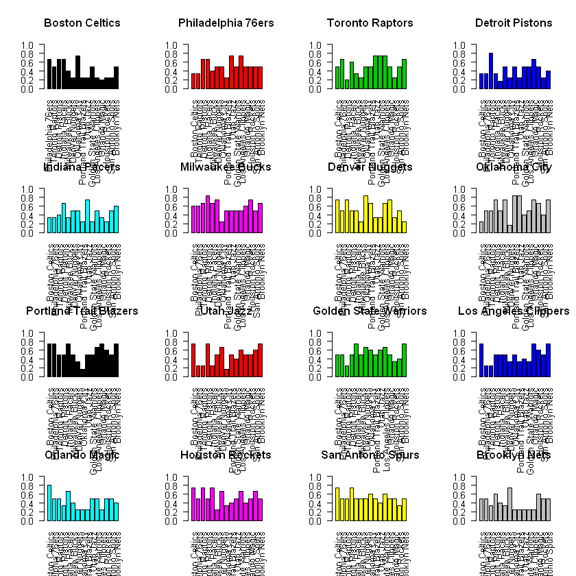


- $\alpha, \beta$를 1로 두어 Uniform 사전 분포 사용 (많이 사용되는 하이퍼 파라미터)
- 베이지안 사후 기대 확률(기대 승률)을 팀별로 분석
- 사후 기대 승률은 과거 상대 전적 데이터가 주어졌을 때의 업데이트 된 승률을 계산
- 모든 팀들이 상대 팀들을 이길 가능성이 존재하게 됨 (모두 0값이 아님)
- 다른 팀에 대해 극단적으로 이길 가능성이 줄어들음

# 7. Monte Carlo Simulation


```R
#install.packages('imager',repo="https://cloud.r-project.org")
library(imager)
im<-load.image("./NBA_playoff.png")
plot(im)
```


출처 :https://www.nba.com/playoffs#/ <br>
위 사진은 이미 16강이 진행된 대진표이지만 실제 분석에서는 경기가 하나도 진행 안 됐다고 가정

Simulation 절차:
1. 플레이오프 대진표 대로 경기를 하게 함
2. 계산된 MLE 혹은 사후 기대확률을 통해 7번의 경기를 치루게함
3. 7번 중 4회 이상 이긴 팀이 다음 라운드로 진출
4. 위와 같은 절차를 10,000번 반복해 평균 우승 확률을 추정


```R
set.seed(0)

finalwinner<-function(R,Posterior_expectation){
    final <- numeric(R)
    for (i in 1:R){


    # Golden state defeats Clippers (11,12)
    v11<-sample(c(1,0),7,replace=TRUE,prob=c(Posterior_expectation[11,12],1-Posterior_expectation[11,12]))
    if (sum(v11)>=4){
    w11 <- 11
    } else{
    w11 <- 12
    }

    # Houston defeats Utah (14,10)
    v12<-sample(c(1,0),7,replace=TRUE,prob=c(Posterior_expectation[14,10],1-Posterior_expectation[14,10]))
    if (sum(v12)>=4){
    w12 <- 14
    } else{
    w12 <- 10
    }


    # Portland defeats Oklahoma (9,8)
    v13<-sample(c(1,0),7,replace=TRUE,prob=c(Posterior_expectation[9,8],1-Posterior_expectation[9,8]))
    if (sum(v13)>=4){
    w13 <- 9
    } else{
    w13 <- 8
    }

    # Denver defeats San Antonio(7,15)
    v14<-sample(c(1,0),7,replace=TRUE,prob=c(Posterior_expectation[7,15],1-Posterior_expectation[7,15]))
    if (sum(v14)>=4){
    w14 <- 7
    } else{
    w14 <- 15
    }

    # Milwaukee defeats Detroit (6,4)
    v15<-sample(c(1,0),7,replace=TRUE,prob=c(Posterior_expectation[6,4],1-Posterior_expectation[6,4]))
    if (sum(v15)>=4){
    w15 <- 6
    } else{
    w15 <- 4
    }

    # Boston defeats Indiana(1,5)
    v16<-sample(c(1,0),7,replace=TRUE,prob=c(Posterior_expectation[1,5],1-Posterior_expectation[1,5]))
    if (sum(v16)>=4){
    w16 <- 1
    } else{
    w16 <- 5
    }


    # Philadelphia defeats Brooklyn(2,16)
    v17<-sample(c(1,0),7,replace=TRUE,prob=c(Posterior_expectation[2,16],1-Posterior_expectation[2,16]))
    if (sum(v17)>=4){
    w17 <- 2
    } else{
    w17 <- 16
    }


    # Torront defeats Orlando (3,13)
    v18<-sample(c(1,0),7,replace=TRUE,prob=c(Posterior_expectation[3,13],1-Posterior_expectation[3,13]))
    if (sum(v18)>=4){
    w18 <- 3
    } else{
    w18 <- 13
    }


    ####8
    v21<-sample(c(1,0),7,replace=TRUE,prob=c(Posterior_expectation[w11,w12],1-Posterior_expectation[w11,w12]))
    if (sum(v21)>=4){
    w21 <- w11
    } else{
    w21 <- w12
    }

    v22<-sample(c(1,0),7,replace=TRUE,prob=c(Posterior_expectation[w13,w14],1-Posterior_expectation[w13,w14]))
    if (sum(v22)>=4){
    w22 <- w13
    } else{
    w22 <- w14
    }

    v23<-sample(c(1,0),7,replace=TRUE,prob=c(Posterior_expectation[w15,w16],1-Posterior_expectation[w15,w16]))
    if (sum(v23)>=4){
    w23 <- w15
    } else{
    w23 <- w16
    }

    v24<-sample(c(1,0),7,replace=TRUE,prob=c(Posterior_expectation[w11,w12],1-Posterior_expectation[w11,w12]))
    if (sum(v24)>=4){
    w24 <- w17
    } else{
    w24 <- w18
    }


    #######semi-final

    v31<-sample(c(1,0),7,replace=TRUE,prob=c(Posterior_expectation[w21,w22],1-Posterior_expectation[w21,w22]))
    if (sum(v31)>=4){
    w31 <- w21
    } else{
    w31 <- w22
    }

    v32<-sample(c(1,0),7,replace=TRUE,prob=c(Posterior_expectation[w23,w24],1-Posterior_expectation[w23,w24]))
    if (sum(v32)>=4){
    w32 <- w23
    } else{
    w32 <- w24
    }

    #######Final


    v41<-sample(c(1,0),7,replace=TRUE,prob=c(Posterior_expectation[w31,w32],1-Posterior_expectation[w31,w32]))
    if (sum(v41)>=4){
    final[i] <- w31
    } else{
    final[i] <- w32
    }
    
    }#end of for loop    
    out <- data.frame(mean(final==1),mean(final==2),mean(final==3),mean(final==4),mean(final==5),mean(final==6),mean(final==7),mean(final==8),mean(final==9),mean(final==10),mean(final==11),mean(final==12),mean(final==13),mean(final==14),mean(final==15),mean(final==16))
    colnames(out) <- TEAMS2
        return(out)
}
```

<b>MLE</b>


```R
Frequentist<-finalwinner(10000,Mean_matrix)
Frequentist
```


<table>
<thead><tr><th scope=col>Boston Celtics</th><th scope=col>Philadelphia 76ers</th><th scope=col>Toronto Raptors</th><th scope=col>Detroit Pistons</th><th scope=col>Indiana Pacers</th><th scope=col>Milwaukee Bucks</th><th scope=col>Denver Nuggets</th><th scope=col>Oklahoma City</th><th scope=col>Portland Trail Blazers</th><th scope=col>Utah Jazz</th><th scope=col>Golden State Warriors</th><th scope=col>Los Angeles Clippers</th><th scope=col>Orlando Magic</th><th scope=col>Houston Rockets</th><th scope=col>San Antonio Spurs</th><th scope=col>Brooklyn Nets</th></tr></thead>
<tbody>
	<tr><td>0.0151</td><td>0.0249</td><td>0.0098</td><td>0     </td><td>3e-04 </td><td>0.5069</td><td>0.0102</td><td>0.0466</td><td>0     </td><td>0.047 </td><td>0.1245</td><td>0.0055</td><td>0.0362</td><td>0.0713</td><td>0.0943</td><td>0.0074</td></tr>
</tbody>
</table>


```R
###MLE

par(mfrow=c(2,2))
barplot(as.matrix(Frequentist[1,]),las=2 ,col=2,ylim=c(0,1))
```


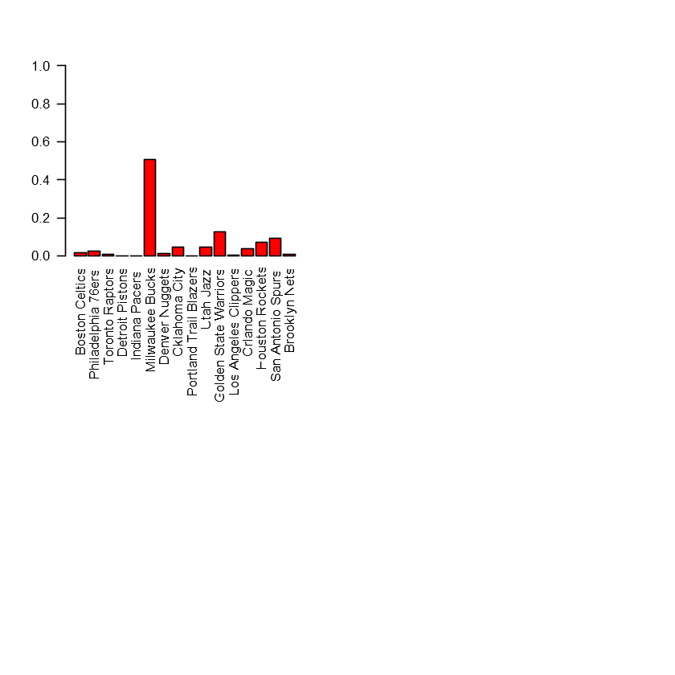


- 10,000번 중 Milwaukee가 5,000번을 넘게 우승
- 다른 팀들의 우승 횟수가 전반적으로 너무 낮아 비현실적 (2등인 Golden state가 1,300번)
- Detroit, Indiana, Oklahoma, Portland, Brooklyn은 거의 0%

<b>Bayesian with Independence Sampler vs Conjugacy</b>

Independence Sampler를 이용해서 추정된 확률과 Conjugacy를 이용해 바로 계산한 결과를 비교<br>
Conjugacy를 이용한 결과가 더 정확한 계산이지만 Independence Sampler를 이용하면 더 많은 randomness가 반영될 수 있음


```R
Bayes_sim<-finalwinner(10000,Sim_matrix2)
Bayes_sim
```


<table>
<thead><tr><th scope=col>Boston Celtics</th><th scope=col>Philadelphia 76ers</th><th scope=col>Toronto Raptors</th><th scope=col>Detroit Pistons</th><th scope=col>Indiana Pacers</th><th scope=col>Milwaukee Bucks</th><th scope=col>Denver Nuggets</th><th scope=col>Oklahoma City</th><th scope=col>Portland Trail Blazers</th><th scope=col>Utah Jazz</th><th scope=col>Golden State Warriors</th><th scope=col>Los Angeles Clippers</th><th scope=col>Orlando Magic</th><th scope=col>Houston Rockets</th><th scope=col>San Antonio Spurs</th><th scope=col>Brooklyn Nets</th></tr></thead>
<tbody>
	<tr><td>0.1343</td><td>0.0626</td><td>0.0685</td><td>0.0113</td><td>0.0142</td><td>0.1579</td><td>0.1143</td><td>0.0694</td><td>0.0156</td><td>0.0752</td><td>0.1088</td><td>0.0121</td><td>0.0373</td><td>0.0562</td><td>0.0415</td><td>0.0208</td></tr>
</tbody>
</table>


```R
### Bayesian
Bayesian<-finalwinner(10000,Posterior_expectation)
Bayesian
```


<table>
<thead><tr><th scope=col>Boston Celtics</th><th scope=col>Philadelphia 76ers</th><th scope=col>Toronto Raptors</th><th scope=col>Detroit Pistons</th><th scope=col>Indiana Pacers</th><th scope=col>Milwaukee Bucks</th><th scope=col>Denver Nuggets</th><th scope=col>Oklahoma City</th><th scope=col>Portland Trail Blazers</th><th scope=col>Utah Jazz</th><th scope=col>Golden State Warriors</th><th scope=col>Los Angeles Clippers</th><th scope=col>Orlando Magic</th><th scope=col>Houston Rockets</th><th scope=col>San Antonio Spurs</th><th scope=col>Brooklyn Nets</th></tr></thead>
<tbody>
	<tr><td>0.0278</td><td>0.0374</td><td>0.0318</td><td>8e-04 </td><td>0.0028</td><td>0.3383</td><td>0.0411</td><td>0.0777</td><td>0.0019</td><td>0.0612</td><td>0.1175</td><td>0.0172</td><td>0.0552</td><td>0.0932</td><td>0.0793</td><td>0.0168</td></tr>
</tbody>
</table>


```R
par(mfrow=c(2,2))
barplot(as.matrix(Bayesian[1,]),las=2,ylim=c(0,1))
barplot(as.matrix(Bayes_sim[1,]),las=2,ylim=c(0,1),col=1)
```


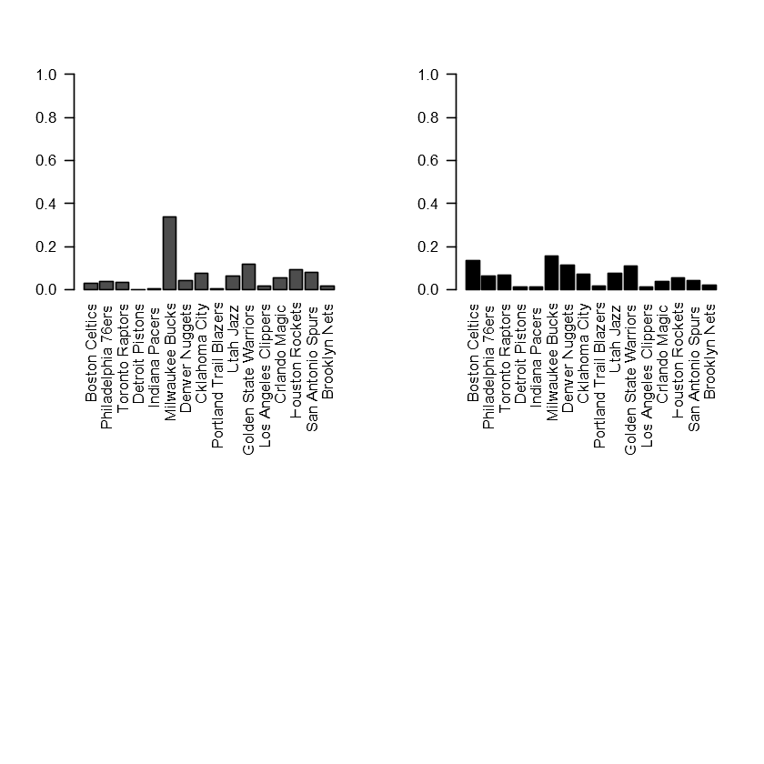


Conjugacy 이용했을 때 (왼쪽 그림 )
- Milwaukee의 우승 확률이 34.6%로 하향 조정, 2위 Golden State도 하향 됨
- Toronto, Houston 등의 우승 확률 소폭 증가
- 전체적인 우승 예측 경향이 MLE 방식과 큰 차이가 있지는 않음
- Detroit의 우승 확률은 여전히 0

Independency 이용했을 때 (오른쪽 그림 )
- Independence sampler로 sampling 한 후 시뮬레이션 했을 때 왼쪽과 같이 Boston, Golden State, Denver, Utah의 우승 확률이 높아짐

# <b>8. 하이퍼 파리미터 조절</b>

Bayesian Poseterior Mean<br>
$E[p_{i,j}|Y_{i,j}]=\frac{y_{i,j}+\alpha}{n_{i,j}+\alpha+\beta} $<br>
$=\frac{n_{i,j}y_{i,j}}{n_{i,j}(n_{i,j}+\alpha+\beta)}+\frac{(\alpha+\beta)\alpha}{(\alpha+\beta)(n_{i,j}+\alpha+\beta) } $<br>
$=\frac{n_{i,j}} {n_{i,j}+\alpha+\beta}\hat{y}_{MLE}+\frac{\alpha+\beta}{n_{i,j}+\alpha+\beta}E[p] $

$(\alpha +\beta)$를 감소 시킬 수록 MLE에 가까워지고 증가시킬수록 prior mean에 가까워짐<br>
$\alpha, \beta$의 값에 따라 beta 분포의 모양이 달라지기 때문에 어떤 값을 설정하느냐가 중요


```R
Posterior_expectation2<-post_exp(Win_matrix,Count_matrix,0.5,0.5) #Non informative
Posterior_expectation3<-post_exp(Win_matrix,Count_matrix,3,3) # stronger uniform prior
Posterior_expectation4<-post_exp(Win_matrix,Count_matrix,100,1) #biased for winning
Posterior_expectation5<-post_exp(Win_matrix,Count_matrix,1,100) #biased for losing
Posterior_expectation6<-post_exp(Win_matrix,Count_matrix,0.01,0.01) #unfair coin
```

출처: https://www.cs.ubc.ca/labs/lci/mlrg/slides/Conjugate.pdf


```R
Bayesian2<-finalwinner(10000,Posterior_expectation2)
Bayesian3<-finalwinner(10000,Posterior_expectation3)
Bayesian4<-finalwinner(10000,Posterior_expectation4)
Bayesian5<-finalwinner(10000,Posterior_expectation5)
Bayesian6<-finalwinner(10000,Posterior_expectation6)

```


```R
Bayesian
Bayesian2
Bayesian3
Bayesian4
Bayesian5
Bayesian6
```


<table>
<thead><tr><th scope=col>Boston Celtics</th><th scope=col>Philadelphia 76ers</th><th scope=col>Toronto Raptors</th><th scope=col>Detroit Pistons</th><th scope=col>Indiana Pacers</th><th scope=col>Milwaukee Bucks</th><th scope=col>Denver Nuggets</th><th scope=col>Oklahoma City</th><th scope=col>Portland Trail Blazers</th><th scope=col>Utah Jazz</th><th scope=col>Golden State Warriors</th><th scope=col>Los Angeles Clippers</th><th scope=col>Orlando Magic</th><th scope=col>Houston Rockets</th><th scope=col>San Antonio Spurs</th><th scope=col>Brooklyn Nets</th></tr></thead>
<tbody>
	<tr><td>0.0278</td><td>0.0374</td><td>0.0318</td><td>8e-04 </td><td>0.0028</td><td>0.3383</td><td>0.0411</td><td>0.0777</td><td>0.0019</td><td>0.0612</td><td>0.1175</td><td>0.0172</td><td>0.0552</td><td>0.0932</td><td>0.0793</td><td>0.0168</td></tr>
</tbody>
</table>


<table>
<thead><tr><th scope=col>Boston Celtics</th><th scope=col>Philadelphia 76ers</th><th scope=col>Toronto Raptors</th><th scope=col>Detroit Pistons</th><th scope=col>Indiana Pacers</th><th scope=col>Milwaukee Bucks</th><th scope=col>Denver Nuggets</th><th scope=col>Oklahoma City</th><th scope=col>Portland Trail Blazers</th><th scope=col>Utah Jazz</th><th scope=col>Golden State Warriors</th><th scope=col>Los Angeles Clippers</th><th scope=col>Orlando Magic</th><th scope=col>Houston Rockets</th><th scope=col>San Antonio Spurs</th><th scope=col>Brooklyn Nets</th></tr></thead>
<tbody>
	<tr><td>0.0218</td><td>0.0296</td><td>0.0212</td><td>0     </td><td>0.0023</td><td>0.4113</td><td>0.025 </td><td>0.065 </td><td>3e-04 </td><td>0.0565</td><td>0.124 </td><td>0.011 </td><td>0.0462</td><td>0.086 </td><td>0.0873</td><td>0.0125</td></tr>
</tbody>
</table>


<table>
<thead><tr><th scope=col>Boston Celtics</th><th scope=col>Philadelphia 76ers</th><th scope=col>Toronto Raptors</th><th scope=col>Detroit Pistons</th><th scope=col>Indiana Pacers</th><th scope=col>Milwaukee Bucks</th><th scope=col>Denver Nuggets</th><th scope=col>Oklahoma City</th><th scope=col>Portland Trail Blazers</th><th scope=col>Utah Jazz</th><th scope=col>Golden State Warriors</th><th scope=col>Los Angeles Clippers</th><th scope=col>Orlando Magic</th><th scope=col>Houston Rockets</th><th scope=col>San Antonio Spurs</th><th scope=col>Brooklyn Nets</th></tr></thead>
<tbody>
	<tr><td>0.0494</td><td>0.0503</td><td>0.0496</td><td>0.0085</td><td>0.0167</td><td>0.2057</td><td>0.0706</td><td>0.0859</td><td>0.0188</td><td>0.0654</td><td>0.0971</td><td>0.0287</td><td>0.0596</td><td>0.087 </td><td>0.0712</td><td>0.0355</td></tr>
</tbody>
</table>


<table>
<thead><tr><th scope=col>Boston Celtics</th><th scope=col>Philadelphia 76ers</th><th scope=col>Toronto Raptors</th><th scope=col>Detroit Pistons</th><th scope=col>Indiana Pacers</th><th scope=col>Milwaukee Bucks</th><th scope=col>Denver Nuggets</th><th scope=col>Oklahoma City</th><th scope=col>Portland Trail Blazers</th><th scope=col>Utah Jazz</th><th scope=col>Golden State Warriors</th><th scope=col>Los Angeles Clippers</th><th scope=col>Orlando Magic</th><th scope=col>Houston Rockets</th><th scope=col>San Antonio Spurs</th><th scope=col>Brooklyn Nets</th></tr></thead>
<tbody>
	<tr><td>0</td><td>0</td><td>0</td><td>0</td><td>0</td><td>0</td><td>0</td><td>0</td><td>0</td><td>0</td><td>1</td><td>0</td><td>0</td><td>0</td><td>0</td><td>0</td></tr>
</tbody>
</table>


<table>
<thead><tr><th scope=col>Boston Celtics</th><th scope=col>Philadelphia 76ers</th><th scope=col>Toronto Raptors</th><th scope=col>Detroit Pistons</th><th scope=col>Indiana Pacers</th><th scope=col>Milwaukee Bucks</th><th scope=col>Denver Nuggets</th><th scope=col>Oklahoma City</th><th scope=col>Portland Trail Blazers</th><th scope=col>Utah Jazz</th><th scope=col>Golden State Warriors</th><th scope=col>Los Angeles Clippers</th><th scope=col>Orlando Magic</th><th scope=col>Houston Rockets</th><th scope=col>San Antonio Spurs</th><th scope=col>Brooklyn Nets</th></tr></thead>
<tbody>
	<tr><td>0</td><td>0</td><td>0</td><td>0</td><td>0</td><td>0</td><td>0</td><td>0</td><td>0</td><td>0</td><td>0</td><td>0</td><td>1</td><td>0</td><td>0</td><td>0</td></tr>
</tbody>
</table>


<table>
<thead><tr><th scope=col>Boston Celtics</th><th scope=col>Philadelphia 76ers</th><th scope=col>Toronto Raptors</th><th scope=col>Detroit Pistons</th><th scope=col>Indiana Pacers</th><th scope=col>Milwaukee Bucks</th><th scope=col>Denver Nuggets</th><th scope=col>Oklahoma City</th><th scope=col>Portland Trail Blazers</th><th scope=col>Utah Jazz</th><th scope=col>Golden State Warriors</th><th scope=col>Los Angeles Clippers</th><th scope=col>Orlando Magic</th><th scope=col>Houston Rockets</th><th scope=col>San Antonio Spurs</th><th scope=col>Brooklyn Nets</th></tr></thead>
<tbody>
	<tr><td>0.0165</td><td>0.0238</td><td>0.0106</td><td>0     </td><td>2e-04 </td><td>0.4961</td><td>0.011 </td><td>0.0471</td><td>0     </td><td>0.0502</td><td>0.1303</td><td>0.0064</td><td>0.0358</td><td>0.0727</td><td>0.0927</td><td>0.0066</td></tr>
</tbody>
</table>


```R
par(mfrow=c(2,2))
barplot(as.matrix(Bayesian[1,]),las=2,ylim=c(0,1), main='alpha=1 beta=1')
barplot(as.matrix(Bayesian2[1,]),las=2,ylim=c(0,1),col=1, main='alpha=0.5 beta=0.5')

```


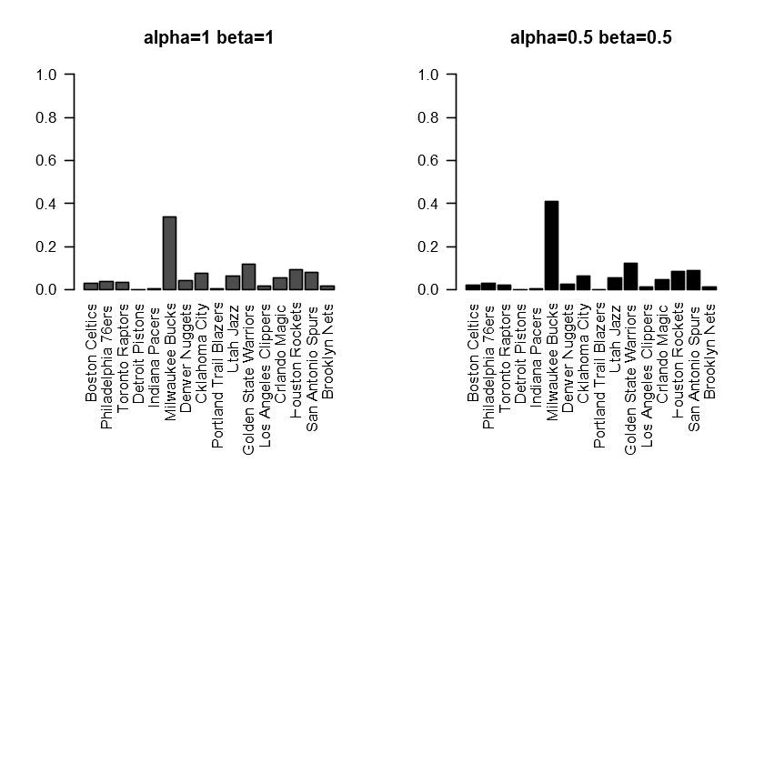


```R
par(mfrow=c(2,2))
barplot(as.matrix(Bayesian3[1,]),las=2,ylim=c(0,1),col=2, main='alpha=3 beta=3')
barplot(as.matrix(Bayesian4[1,]),las=2,ylim=c(0,1),col=3, main='alpha=100 beta=1')

```


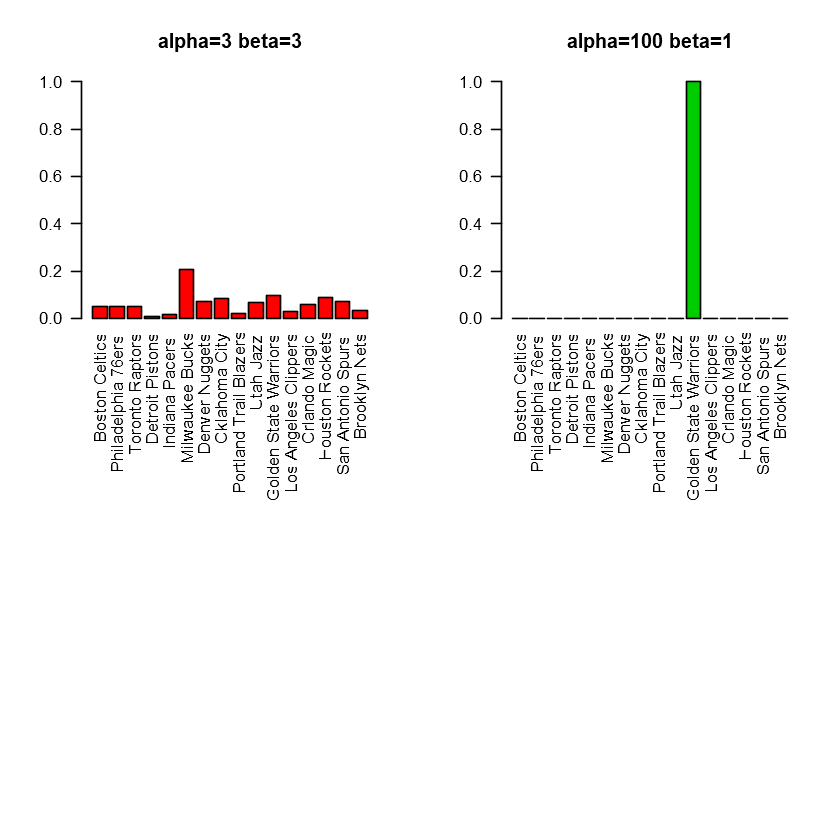


```R
par(mfrow=c(2,2))
barplot(as.matrix(Bayesian5[1,]),las=2,ylim=c(0,1),col=4, main='alpha=1 beta=100')
barplot(as.matrix(Bayesian6[1,]),las=2,ylim=c(0,1),col=5, main='alpha=0.01 beta=0.01')
```


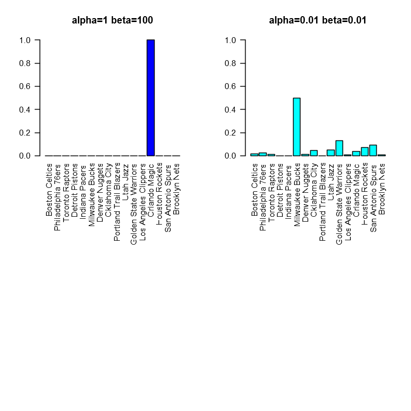


```R
par(mfrow=c(4,4))
for (i in 1:16){

    barplot(Posterior_expectation2[i,-i],main=TEAMS2[i] ,las=2,col=i,ylim=c(0,1))

}
```


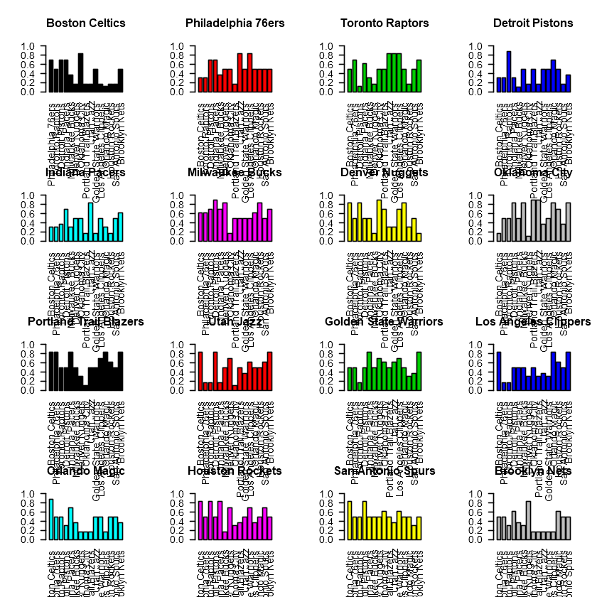


```R
Sim_matrix2=matrix(0,16,16)
colnames(Sim_matrix2)=TEAMS2
rownames(Sim_matrix2)=TEAMS2
```


```R
Sim_mean<-function(Sim_matrix,a,b){
    for (i in 1:16){
        for (j in 1:16){
            if ( is.na(Count_matrix[i,j])==TRUE){
                Sim_matrix[i,j]<-NA
            }
            else{
                BB<-independence.sampler(Win_matrix[i,j],Count_matrix[i,j],a,b)
                Sim_matrix[i,j]<-mean(BB[((m/2) +1):m])


            }

        }

    }
    return(Sim_matrix)
}    
```


```R
a<-Sim_mean(Sim_matrix2,0.5,0.5)

```


```R
Bayes_sim2<-finalwinner(10000,a)
```


```R
Bayes_sim
Bayes_sim2
```


<table>
<thead><tr><th scope=col>Boston Celtics</th><th scope=col>Philadelphia 76ers</th><th scope=col>Toronto Raptors</th><th scope=col>Detroit Pistons</th><th scope=col>Indiana Pacers</th><th scope=col>Milwaukee Bucks</th><th scope=col>Denver Nuggets</th><th scope=col>Oklahoma City</th><th scope=col>Portland Trail Blazers</th><th scope=col>Utah Jazz</th><th scope=col>Golden State Warriors</th><th scope=col>Los Angeles Clippers</th><th scope=col>Orlando Magic</th><th scope=col>Houston Rockets</th><th scope=col>San Antonio Spurs</th><th scope=col>Brooklyn Nets</th></tr></thead>
<tbody>
	<tr><td>0.1343</td><td>0.0626</td><td>0.0685</td><td>0.0113</td><td>0.0142</td><td>0.1579</td><td>0.1143</td><td>0.0694</td><td>0.0156</td><td>0.0752</td><td>0.1088</td><td>0.0121</td><td>0.0373</td><td>0.0562</td><td>0.0415</td><td>0.0208</td></tr>
</tbody>
</table>


<table>
<thead><tr><th scope=col>Boston Celtics</th><th scope=col>Philadelphia 76ers</th><th scope=col>Toronto Raptors</th><th scope=col>Detroit Pistons</th><th scope=col>Indiana Pacers</th><th scope=col>Milwaukee Bucks</th><th scope=col>Denver Nuggets</th><th scope=col>Oklahoma City</th><th scope=col>Portland Trail Blazers</th><th scope=col>Utah Jazz</th><th scope=col>Golden State Warriors</th><th scope=col>Los Angeles Clippers</th><th scope=col>Orlando Magic</th><th scope=col>Houston Rockets</th><th scope=col>San Antonio Spurs</th><th scope=col>Brooklyn Nets</th></tr></thead>
<tbody>
	<tr><td>0.0579</td><td>0.0466</td><td>0.0325</td><td>0.0085</td><td>0.0048</td><td>0.2589</td><td>0.0559</td><td>0.0763</td><td>0.0255</td><td>0.0409</td><td>0.1618</td><td>0.0292</td><td>0.0271</td><td>0.1215</td><td>0.0386</td><td>0.014 </td></tr>
</tbody>
</table>


```R
par(mfrow=c(2,2))
barplot(as.matrix(Bayes_sim[1,]),las=2,ylim=c(0,1), main='alpha=1 beta=1')
barplot(as.matrix(Bayes_sim2[1,]),las=2,ylim=c(0,1),col=1, main='alpha=0.5 beta=0.5')
```


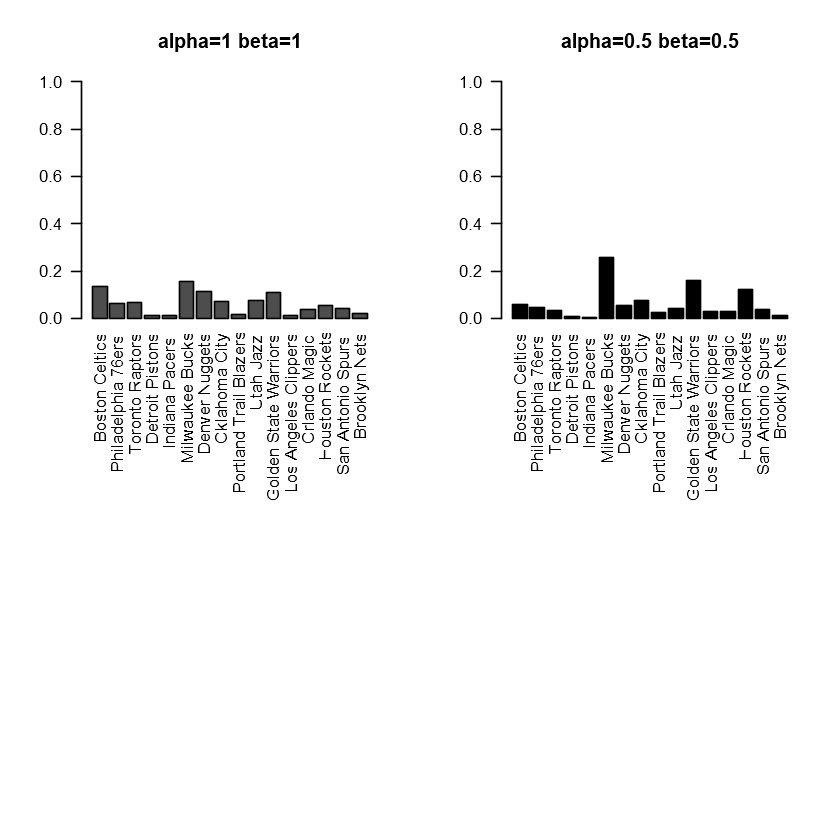


# 
